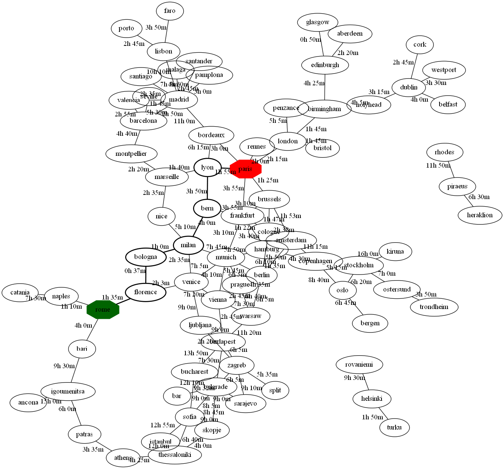

# EurailShortestPath
Shortest Path finder for Eurail using Dijkstra's Algorithm

Description
-----
This projects loads a route system from comma seperated text document, and
returns shortest path between requested stops. It can record the resultant path
to a gv file (visualized graph).

Dependencies
-----
adaptable_heap_priority_queue.py
Empty.py
graph.py
heap_priority_queue.py
linked_stack.py
priority_queue_base.py
project5.py
shortest_paths.py
TripPlanner.py

Requirements
-----
- Python 3
    - copy
    - argparse
    - sys

Run as
-----
usage: project5.py timeTable [-h] [--itinerary  ITINERARY]

Operation
-----
user can input an origin and destination for his trip to find the shortest
path.

Output
-----
Program print the shortest path if found or an information message if the was
no connection between the stops.
Optional itinerary saves the whole system (nodes and routes) in a .gv with
start point as green and endpoint as blue. The shortest path is highlighted and
stops with more than 3 incoming route (major stops) are shown by double circle
in the path.
Using GraphWiz, the program print a visual map with highlighted paths.

